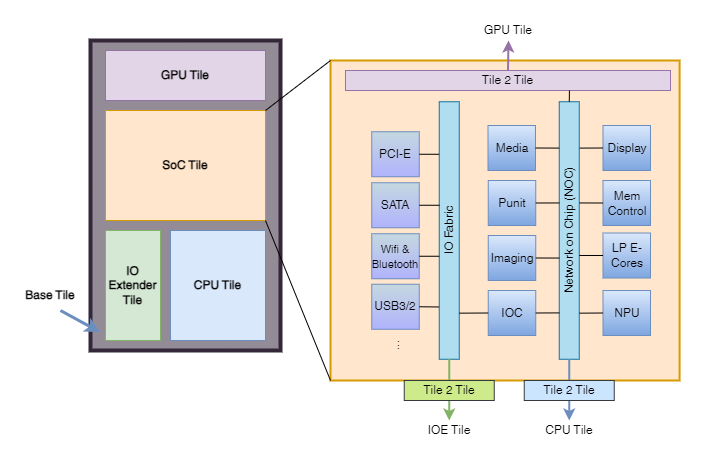
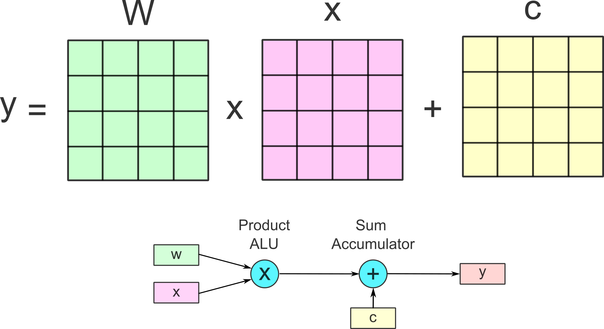
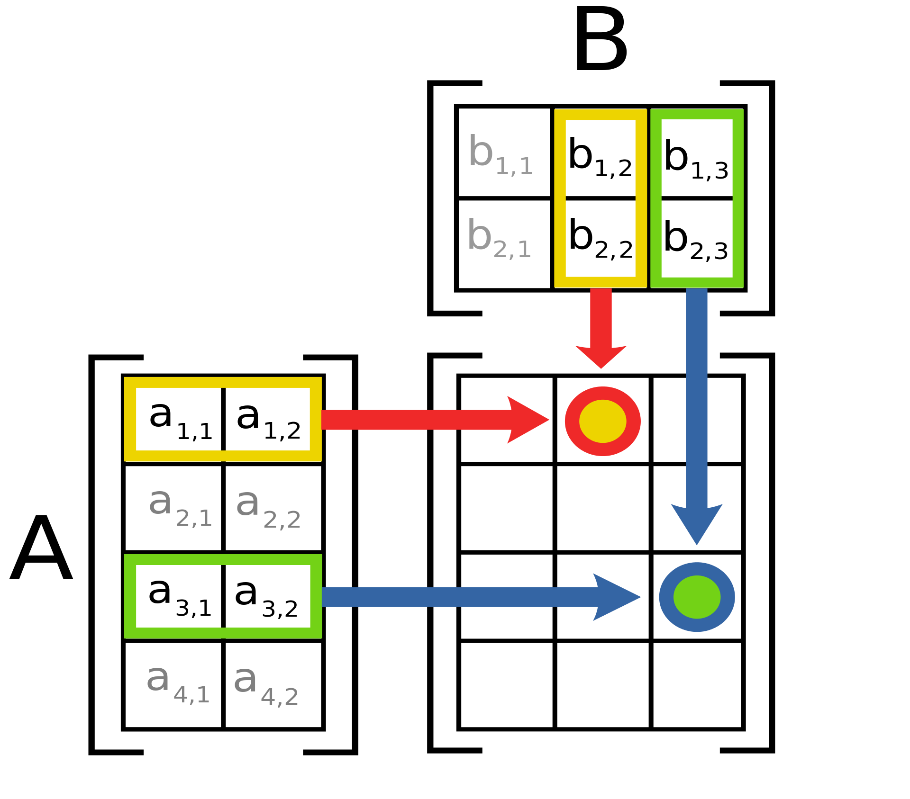

# Choosing the Optimal Computer

Though Python is runnable on most of modern operating systems (OS) including Windows, MacOS and Linux, it is beneficial to keep scripting under *nix environment. Here we provide a guide for beginners to choose your computing hardwares.

This guide is intentionally written for programming beginners to code locally. For advance research units equip with python servers, we will cover a series of remote coding techniques to unleash more complex bioimage analysis.

## General Guide 

When choosing a computer for bioimage analysis, it's essential to consider hardware performance, memory size, OS, portability, and application scenarios. Here’s a summary comparing different computing modalities:

| Feature                   | Laptops                                  | Desktops                                 | Workstations                             | Servers                                   |
|---------------------------|------------------------------------------|------------------------------------------|------------------------------------------|------------------------------------------|
| **Hardware Performance**  | Mid-range to high-end CPUs and GPUs      | High-end CPUs and GPUs                   | Top-tier CPUs and multiple GPUs          | Multiple high-end CPUs and GPUs          |
| **Memory Size**           | Up to 64GB (most have 16GB-32GB)         | Up to 128GB or more                      | 128GB to 512GB or more                   | Terabytes of RAM                         |
| **GPU**                   | Integrated or dedicated GPUs | High-end dedicated GPUs (e.g., NVIDIA RTX) | Professional GPUs (e.g., NVIDIA Quadro/RTX A-series) | Multiple professional GPUs (e.g., NVIDIA Tesla/Quadro) |
| **NPU**                   | SoC Dependent                | Limited NPU support                      | Available in some high-end models        | Available, especially in AI-optimized servers |
| **OS**                    | Windows, macOS, Linux                    | Windows, macOS, Linux                    | Windows, macOS, Linux                           | Linux, Windows Server                    |
| **Portability**           | Highly portable                          | Not portable                             | Not portable                             | Not portable                             |
| **Application Scenarios** | Mobile work, basic to moderate tasks     | Stationary use, moderate to intensive tasks | Intensive tasks, advanced analysis       | Large-scale projects, remote access, collaborative research |
| **ARM vs x86**            | Mostly x86 (some ARM options like Apple Silicon and Snapdragon XLite) | Mostly x86 except for Apple                               | Mostly x86 except for Apple                               | Mostly x86 (ARM servers available, e.g., AWS Graviton) |
| **ARM Performance**       | Energy-efficient, good for battery life  | Limited use, lower performance than x86, suitable for edging computing like smart microscopy  | Rare, used in specific scenarios         | High efficiency, used in cloud services  |
| **x86 Performance**       | High performance, widely supported       | Higher performance, widely supported     | Highest performance, widely supported    | Highest performance, widely supported    |

### Key Considerations
- **OS**: Choose the OS based on software compatibility and personal preference. Windows and Linux are common across all device types, with macOS being exclusive to laptops and desktops. More concern is about OS terminal and [shell scripting](#shell-scripting)
- **Processor Architecture**: ARM processors are known for energy efficiency and are increasingly used in laptops (e.g., Apple M1/M2) and servers (e.g., AWS Graviton). x86 processors dominate in performance and are widely supported across all device types, making them the standard choice for high-performance bioimage analysis tasks. For details check [here](#processor-chipset-architecture).
- **GPU**: Essential for handling complex image processing and analysis. Laptops typically have consumer-grade GPUs, while desktops and workstations offer higher-end consumer or professional-grade GPUs. For independent GPU on laptop the power consumption is very high and limited the portability and sustainable coding environment.  Servers can have multiple high-end GPUs optimized for parallel processing and large-scale computations. Considering the domination of CUDA in AI domain, Nvidia is the only recommended vendor. For details of GPU applications check [here](#gpu-support).
- **NPU**: Neural Processing Units are becoming more relevant for AI and machine learning tasks. The performance across vendors are yet to be benchmarked. To understand more about NPUs read the section [here](#neural-processing-unit-npu).

### Summary:
- **Laptops**: Best for portability and moderate analysis tasks, with some ARM options for better energy efficiency.
- **Desktops**: Offer higher performance and memory capacity, suitable for stationary use with high-end GPU options.
- **Workstations**: Provide top-tier performance with advanced GPU and NPU options, ideal for demanding bioimage analysis tasks.
- **Servers**: Unmatched in performance and memory, perfect for large-scale, collaborative, and remote-access analysis tasks, with ARM options for energy-efficient cloud computing.

Choose the appropriate device based on your specific needs, considering the balance between portability, performance, and the nature of your bioimage analysis tasks.

## Shell Scripting
For historical reason the command line (CLI) batch scripting is divided into unix-like bash (MacOS, Linux) and DOS-like Powershell (Windows). For Windows users it is always recommended to run Python alongside with Git bash (https://git-scm.com/downloads) that maximally mimic the running *nix running environment.

With the seamless integration of bash terminal, remote SSH and Jupyter extension in VSCode, the experience of different operating systems does not differ very much. But under certain special occasions like 2FA security login to computing clusters, Linux or MacOS can retain a better experience with *nix specialised functions like SSH sockets for connection persistence.

| Operating System | Terminal Emulator            | Default Shell    | Additional Shells                   | Pros                                                                         | Cons                                                               |
|------------------|------------------------------|------------------|-------------------------------------|------------------------------------------------------------------------------|--------------------------------------------------------------------|
| Linux            | GNOME Terminal, Konsole      | Bash             | Zsh, Fish, Ksh, Tcsh, Dash          | Highly customizable, vast array of tools, strong community support, open-source | Fragmentation in terminal emulators, varying default configurations|
| macOS            | Terminal, iTerm2             | Zsh (since 10.15) | Bash, Fish, Ksh, Tcsh               | User-friendly, well-integrated with macOS, iTerm2 offers advanced features    | Terminal app is less feature-rich compared to iTerm2              |
| Windows          | Command Prompt, PowerShell, Windows Terminal | PowerShell       | Bash (via WSL), Git Bash, Cygwin    | Powerful scripting capabilities in PowerShell, WSL brings Linux compatibility | Command Prompt is limited, PowerShell syntax can be complex       |

## Processor Chipset Architecture

  
  
<em>Intel Meteror Lake processor architecture. Modern day IC vendors tends to integrate various computation components on one single chipset to facilitate performance. When performing bioimage analysis we often utilise the processor's different computational units. Certain processor architectures facilitate more one specific tasks, e.g. image decode/encode tasks can take advantage of Intel Integrated Performance Primitives (IPP) library with hardware level accelerations.</em>

Modern days computer CPUs are more lean to a System-on-a-Chip (SoC) that integrates all major components of a computing device including CPU, GPU, NPU and RAM. The physically compactness brings shorter communication route among each computing units, hence facilitate computing performance.

However the SoCs may still classified by the CPUs instruction sets, mainly x86 and ARM. Python libraries natively built on one of the architecture may not be directly runnable on the other, unless with OS layer translation or code compilation from source. i.e. Legacy x86 Python libraries may not be runnable on ARM computers. For power performance reason we see chipset manufacturers are releasing new SoCs in ARM architecture, yet most of the existing bioimage analysis software are pre-compiled in x86. With the effort of Apple Rosetta 2, the issue is more relieved yet not 100% compatible. So bare in mind in choosing the adequate CPU for your analysis work.

When necessary, consult the code developer for the support to the CPU platforms. Following is a summary for the CPUs architectures:

| Feature                          | Apple Silicon      | Intel               | AMD               | Snapdragon Xlite   | NVIDIA            |
|----------------------------------|--------------------|---------------------|-------------------|--------------------|--------------------|
| **Architecture**                 | ARM-based          | x86/x86-64          | x86/x86-64        | ARM-based          | ARM-based (Grace CPU) |
| **Notable Series**               | M1, M2             | Core, Xeon          | Ryzen, EPYC       | Snapdragon 8cx     | Grace CPU          |
| **Manufacturing Process**        | 5nm (TSMC)         | 10nm, 7nm, 14nm     | 7nm, 6nm, 5nm     | 7nm (TSMC)         | 5nm (TSMC)         |
| **Performance Cores**            | High-performance   | High-performance    | High-performance  | High-performance   | High-performance   |
| **Efficiency Cores**             | High-efficiency    | Not typical         | Not typical       | High-efficiency    | Not typical        |
| **Integrated Graphics**          | Yes (Apple GPU)    | Yes (Intel Iris, UHD) | Yes (Radeon Graphics) | Yes (Adreno GPU)   | Yes (NVIDIA GPU)   |
| **Thermal Design Power (TDP)**   | Low to moderate    | Moderate to high    | Moderate to high  | Low                | Moderate to high   |
| **Primary Use Cases**            | Laptops, Desktops  | Laptops, Desktops, Servers | Laptops, Desktops, Servers | Laptops, Mobile Devices | HPC, AI, Data Centers |
| **Special Features**             | Unified Memory     | Hyper-Threading, vPro | Simultaneous Multithreading (SMT) | AI Engine, 5G      | AI Acceleration, NVLink |
| **Compatibility**                | macOS              | Windows, Linux, macOS | Windows, Linux   | Windows, Android   | Linux              |

## GPU Support
### AI Training
Though all SoC manufacturers embeds GPU in the chipset, the AI based analysis is largely relying on NVidia CUDA as the base software stack. Common neural network libraries in Python (pyTorch and Tensorflow) are the foundation stone of popular models like UNet, Cellpose and Stardist. Yet we are seeing a recent support to pyTorch AMD ROCm and Intel OneAPI AI acceleration, the community support is fairly limited when comparing to CUDA. Considering the training scalability and infrastructure support across major GPU farms/research clusters, NVidia is still the sole runner when consider new model training.

### AI Inference
Machine learning algorithms consists of two parts: model training and inference. The computation resources for a fixed AI model to be implemented in new data are much smaller than training from scratch. On smaller AI tasks non-CUDA chipsets bring larger options for bioimage analysis. The inference of neural network based AI can be physically accelerated with specifically designed circuits. Such designs are often referred as neural processing units (NPU). NVidia, specifically added Tensor Core in bundle with optimised packages like cuDNN and Transformer Engine, to their later GPU products. We will cover this topic on the later of the article.

  
  
<em>General Matrix Multiplication (GEMM) as the fundamental building block of neural network (NN) operations. The math basis of NNs and image manipulation are similar embarrassingly parallel tasks involving matrices, leading GPU widely used in many machine learning tasks.</em>

### GPGPU Acceleration
Apart from AI applications, bioimage analysis tasks like single plane illumination fluorescent correlation spectroscopy (SPIM-FCS) performs [pixelwise fitting of the autocorrelation function](https://github.com/bpi-oxford/Gpufit/blob/master/Gpufit/models/spim_acfN.cuh). In quantitative imaging one may be interested in photon counting or camera calibrated denoising, that largely relies on the [pixel-by-pixel gain fitting](https://github.com/jackyko1991/sCMOS-Denoise/blob/main/notebooks/camera_calibration.ipynb). Such image analysis can utilise the parallelisation power of GPU to accelerate the research.

One high level analysis package [py-clesperanto](https://github.com/clEsperanto/pyclesperanto_prototype) attempts GPU acceleration based on OpenCL. Such computing process allows bioimage analysis not bound to graphic processing, but to more generic calculations. From this the GPU is often referred as general purpose GPU (GPGPU). Vendors like AMD and Intel are alternatives to NVidia in this sense.

## Neural Processing Unit (NPU)

  
  
<em>Schematic depiction of the outter matrix product AB of two matrices A and B. NPUs implement GEMMs by partitioning the output matrix into tiles, which are then parallel loaded from memory buffer, multiplied and accumulated into output. </em>

A Neural Processing Unit (NPU) is a specialized hardware accelerator designed to efficiently handle the computational demands of AI and machine learning tasks, particularly neural network inference and training. NPUs are optimized for the types of operations commonly used in deep learning, such as matrix multiplications, convolutions, and activation functions. In mid-2024 the NPUs are embedded in various SoCs, allowing a wider choice in AI applications.

| Feature                          | Google TPU (USB/M.2)      | Apple Silicon      | AMD                      | Intel (after Meteor Lake)       | NVIDIA (Grace Hopper)     | NVIDIA (Jetson)           | Snapdragon Xlite          |
|----------------------------------|---------------------------|--------------------|--------------------------|---------------------------|---------------------------|---------------------------|---------------------------|
| **Product Name**                 | Edge TPU                  | Apple Neural Engine| 3rd Gen Ryzen AI| VPU, GNA, AI Engine       | TensorRT, DLA, Grace Hopper| Jetson Xavier, Nano, TX2  | Qualcomm AI Engine        |
| **Primary Use Case**             | Edge AI, Low Power Devices| Mobile, Desktop    | GPUs with AI Capabilities| Mobile, Desktop, Edge AI  | Data Center, HPC, Embedded | Embedded AI     | Mobile, Edge Computing    |
| **Performance**                  | Moderate                  | High               | Moderate to High         | Moderate to High          | Very High                 | Moderate to High          | Moderate                  |
| **Efficiency**                   | High                      | High               | Moderate                 | High                      | Moderate to High          | High                      | High                      |
| **Special Features**             | Google Cloud Compatible, Tensor Operations| Unified Memory, Tight OS Integration | APUs, ROCm | Low Power, Vision Processing, Integrated AI | CUDA Integration, Tensor Cores | Low Power, Integrated AI | Integrated 5G, AI on Device |
| **Flexibility**                  | Specialized for TensorFlow| General Purpose    | AI with General Compute  | Specialized for AI and Vision| Highly Specialized        | General Purpose           | General Purpose           |
| **Compatibility**                | TensorFlow Lite           | macOS              | Windows, Linux           | Windows, Linux            | Windows, Linux            | Linux                     | Android, Windows          |
| **Scalability**                  | High                      | Moderate           | Moderate                 | Moderate                  | High                      | Moderate                  | Moderate                  |
| **Integration**                  | Edge Devices              | Mobile, Desktop    | GPUs                     | Mobile, Desktop, Edge Devices | HPC, Cloud, Embedded      | Embedded Systems| Mobile SoCs               |
| **Availability**                 | USB, M.2 Modules          | Built-in (A-series, M-series)| Radeon Instinct GPUs | Integrated in Meteor Lake CPUs | Available in GPUs, Servers | Available in Embedded Modules | Snapdragon SoCs           |