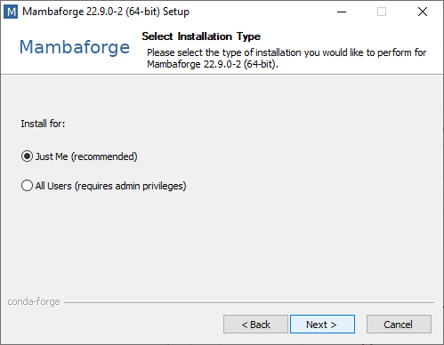
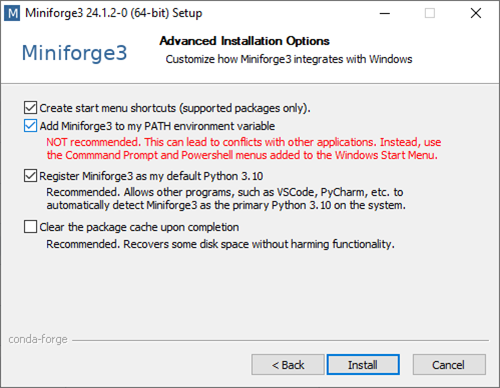
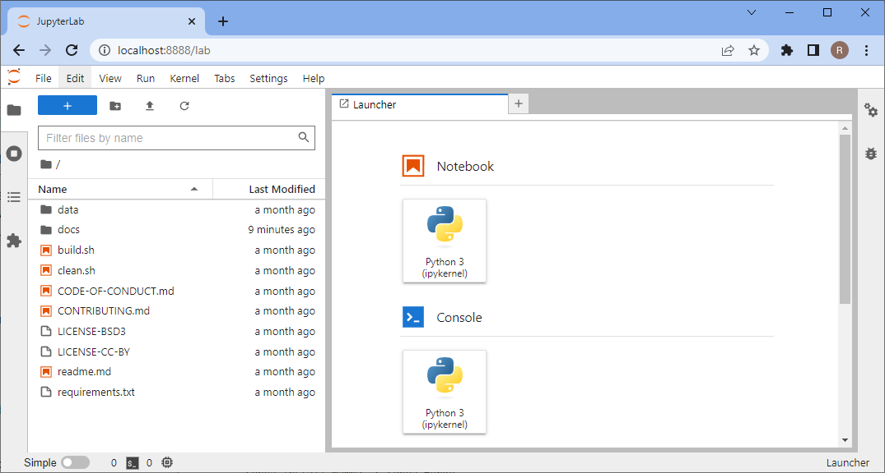
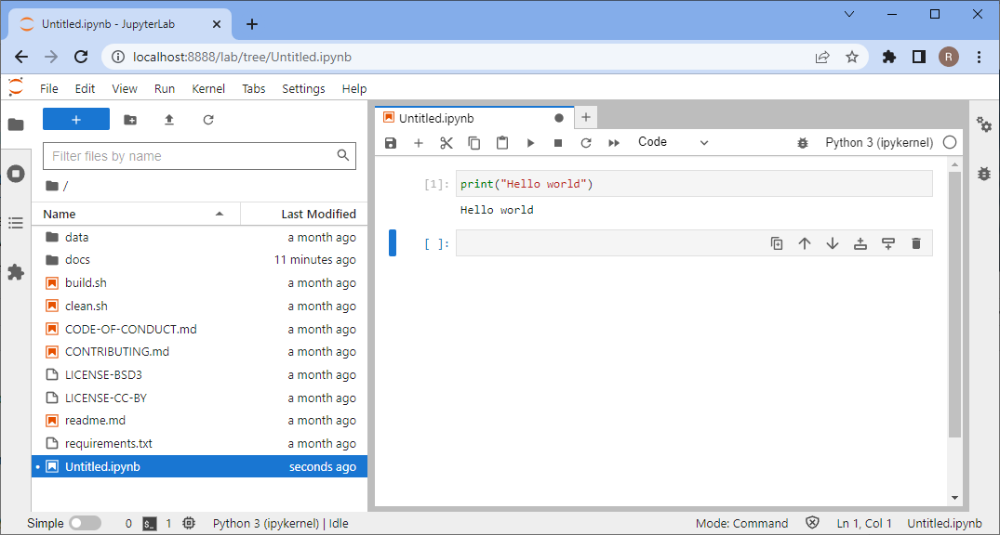
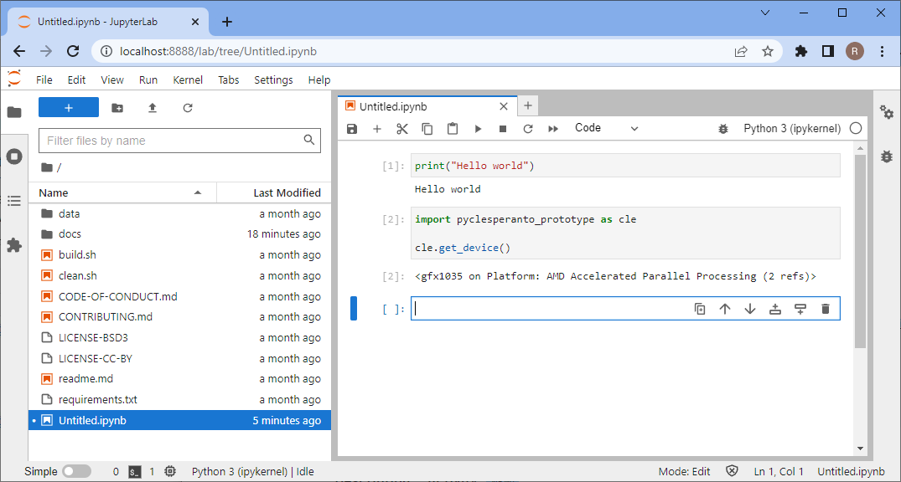

# Setting up your computer

This chapter provides instructions for setting up your computer to run Python to analyse images.

# Setting up Python and Conda environments
When working with Python, we will make use of many plugins and software libraries which need to be organized.
One way of doing this, is by managing *Conda* environments.
A conda environment can be seen as a virtual desktop, or virtual computer, accessible via the terminal. 
If you install some software into one Conda environment, it may not be accessible from another environment. 
If a Conda environment breaks, e.g. incompatible software was installed, you can just make a new one and start over.

See also
* [Getting started with Mambaforge and Python](https://biapol.github.io/blog/mara_lampert/getting_started_with_mambaforge_and_python/readme.html)
* [Managing Scientific Python environments using Conda, Mamba and friends](https://focalplane.biologists.com/2022/12/08/managing-scientific-python-environments-using-conda-mamba-and-friends/)
* [Scientific Data Analysis with Python](https://youtu.be/MOEPe9TGBK0)

## Step 1: Install Mambaforge
Download and install Conda. We recommend the Conda distribution [Mambaforge](https://github.com/conda-forge/miniforge#mambaforge).

For ease-of-use, it is recommended to install it for your use only and to add Conda to the PATH variable during installation.





## Step 2: Install devbio-napari

We recommend installing [devbio-napari](https://github.com/haesleinhuepf/devbio-napari), a distribution of napari with a set of plugins for bioimage analysis.

Use this command from the terminal:

```
mamba create --name devbio-napari-env python=3.9 devbio-napari -c conda-forge
```

**Tip**: It is recommended to create one environment for every project you are executing. 
In that way installed software libraries and tools cannot harm each other.

## Step 3: Testing the installation

Afterwards you can enter the environment to work with it. 
Whenever you want to work on the same project again, you should start a command line and enter this:

```
mamba activate devbio-napari-env
```

Start [Jupyter lab](https://jupyter.org/) from the terminal like this

```
jupyter lab
```

A browser will open and show you the following web page. In the section `Notebook` click on "Python 3 (ipykernel)" to create a new notebook:



In the new notebook, click in the first code cell, enter `print("Hello world")` and hit SHIFT+ENTER on your keyboard. 
If everything is installed properly, it should look like this:



To test if your graphics card driver is properly installed, enter this code:

```
import pyclesperanto_prototype as cle

cle.get_device()
```



## Troubleshooting: Graphics cards drivers

In case error messages contains "ImportError: DLL load failed while importing cl: The specified procedure could not be found" [see also](https://github.com/clEsperanto/pyclesperanto_prototype/issues/55) or ""clGetPlatformIDs failed: PLATFORM_NOT_FOUND_KHR", please install recent drivers for your graphics card and/or OpenCL device. 

Select the right driver source depending on your hardware from this list:

* [AMD drivers](https://www.amd.com/en/support)
* [NVidia drivers](https://www.nvidia.com/download/index.aspx)
* [Intel GPU drivers]()(https://www.intel.com/content/www/us/en/download/726609/intel-arc-graphics-windows-dch-driver.html)
* [Intel CPU OpenCL drivers](https://www.intel.com/content/www/us/en/developer/articles/tool/opencl-drivers.html#latest_CPU_runtime)
* [Microsoft Windows OpenCL support](https://www.microsoft.com/en-us/p/opencl-and-opengl-compatibility-pack/9nqpsl29bfff)

Sometimes, mac-users need to install this:

    mamba install -c conda-forge ocl_icd_wrapper_apple

Sometimes, linux users need to install this:

    mamba install -c conda-forge ocl-icd-system

## Troubleshooting: DLL load failed

In case of error messages such as this one:
```
[...] _get_win_folder_with_pywin32
from win32com.shell import shellcon, shell
ImportError: DLL load failed while importing shell: The specified procedure could not be found.
```

Try this command, within the base environment:

```
conda activate base

pip install --upgrade pywin32==228
```

[Source](https://github.com/conda/conda/issues/11503)
