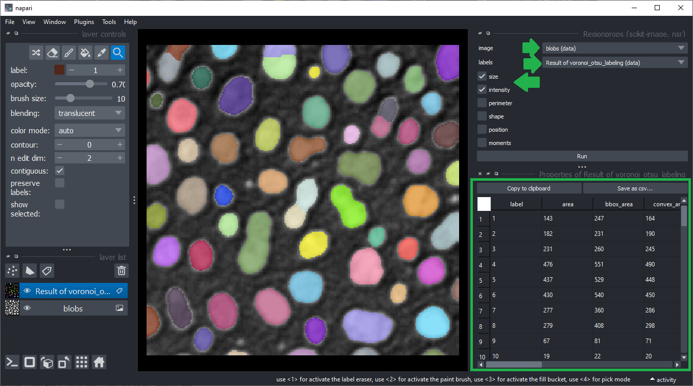
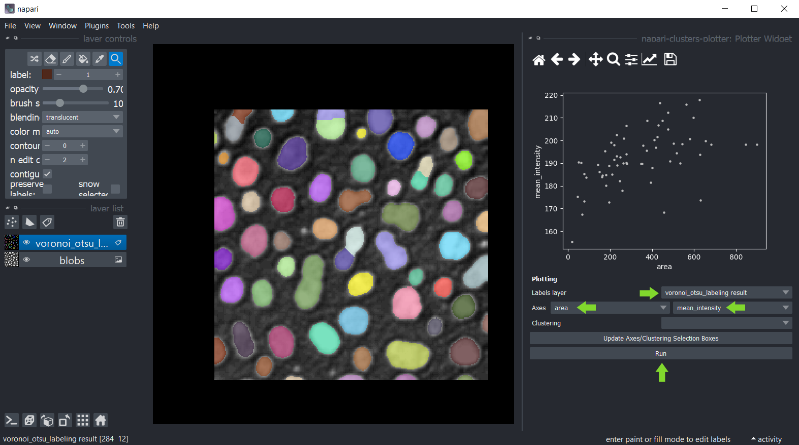
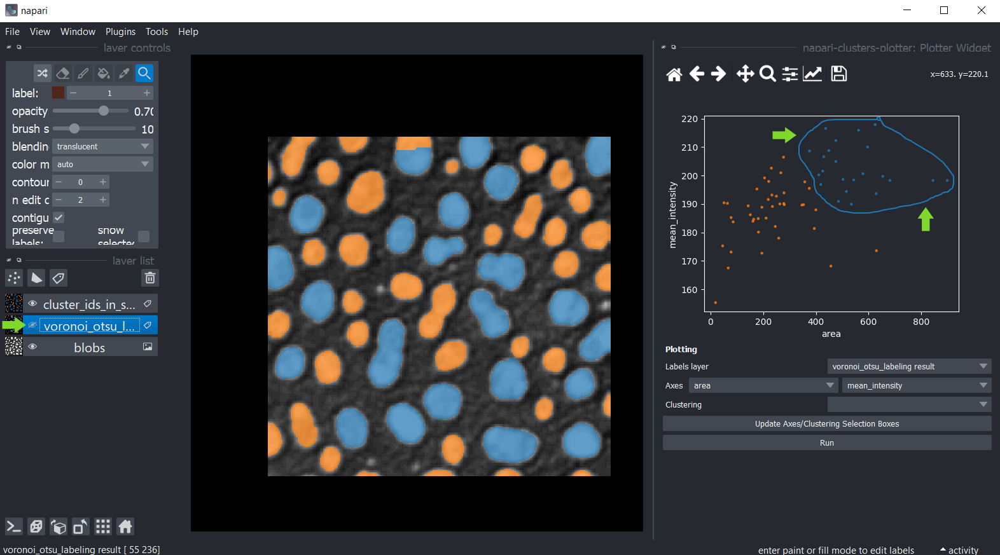
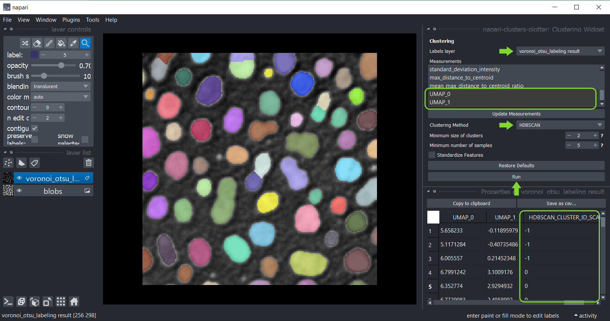
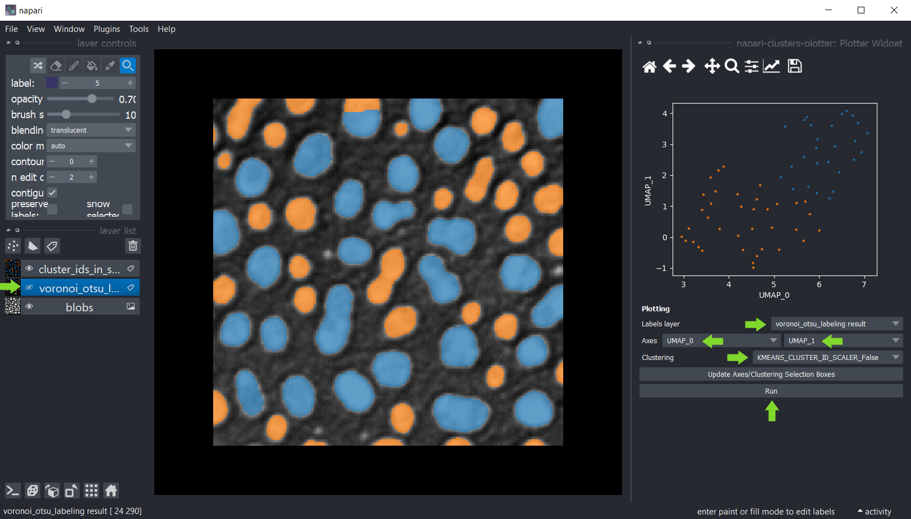

# Interactive dimensionality reduction and clustering 

The [napari-clusters-plotter](https://github.com/BiAPoL/napari-clusters-plotter) offers tools to perform various dimensionality reduction algorithms and clustering methods interactively in Napari.

## Getting started

Open a terminal window and activate your conda environment:

```
conda activate devbio-napari-env
```

Afterwards, start up Napari:

```
napari
```

Load the "Blobs" example dataset from the menu `File > Open Sample > clEsperanto > Blobs (from ImageJ)`.
We also need a label image. You can create it using the menu `Tools > Segmentation / labeling > Gauss-Otsu Labeling (clesperanto)`.

## Starting point
For clustering objects according to their properties, the starting point is an intensity image and a label image
representing a segmentation of objects.


## Measurements
The first step is extracting measurements from the labeled image and the corresponding pixels in the intensity image.
You can use the menu `Tools > Measurement > Regionprops (scikit-image, nsr)` for that.
Just select the intensity image, the corresponding label image and the measurements `intensity`, `size` and `shape` and click on `Run`.
A table with the measurements will open:



Afterwards, you can save and/or close the measurement table. Also, close the Measure widget.

## Plotting

Once measurements were made, these measurements were saved in the `features` of the labels layer which was analysed.
You can then plot these measurements using the menu `Tools > Measurement > Plot measurements (ncp)`.

In this widget, you can select the labels layer which was analysed and the measurements which should be plotted
on the X- and Y-axis. If you cannot see any options in axes selection boxes, but you have performed measurements, click
on `Update Axes/Clustering Selection Boxes` to refresh them. Click on `Run` to draw the data points in the plot area.



You can also manually select a region in the plot. Use the mouse to draw an outline around the region of interest. 
The resulting manual clustering will also be visualized in the original image. 
To optimize visualization in the image, turn off the visibility of the analysed labels layer.



Hold down the SHIFT key while annotating regions in the plot to manually select multiple clusters.


## Dimensionality reduction: UMAP, t-SNE or PCA

For getting more insights into your data, you can reduce the dimensionality of the measurements, e.g.
using the [UMAP algorithm](https://umap-learn.readthedocs.io/en/latest/), [t-SNE](https://scikit-learn.org/stable/modules/generated/sklearn.manifold.TSNE.html)
or [PCA](https://scikit-learn.org/stable/modules/generated/sklearn.decomposition.PCA.html) algorithms.
To apply them to your data use the menu `Tools > Measurement > Dimensionality reduction (ncp)`.
Select the label image that was analysed and in the list below, select all measurements that should be dimensionality reduced. 
By default, all measurements are selected in the box. If you cannot see any measurements, but you have performed them, click on `Update Measurements` to refresh the box. 
You can read more about parameters of both algorithms by hovering over question marks or by clicking on them. 
When you are done with the selection, click on `Run` and after a moment, the table of measurements will re-appear with two additional columns representing the reduced dimensions of the dataset. 
These columns are automatically saved in the `features` of the labels layer.


Afterwards, you can again save and/or close the table. Also, close the Dimensionality Reduction widget.

## Clustering

If the data points are clearly separated, automatic clustering may be an option, using these implemented algorithms:
* [k-means clustering (KMEANS)](https://towardsdatascience.com/k-means-clustering-algorithm-applications-evaluation-methods-and-drawbacks-aa03e644b48a)
* [Hierarchical Density-Based Spatial Clustering of Applications with Noise (HDBSCAN)](https://hdbscan.readthedocs.io/en/latest/how_hdbscan_works.html)
* [Gaussian Mixture Model (GMM)](https://scikit-learn.org/stable/modules/mixture.html)
* [Mean Shift (MS)](https://scikit-learn.org/stable/auto_examples/cluster/plot_mean_shift.html#sphx-glr-auto-examples-cluster-plot-mean-shift-py)
* [Agglomerative clustering (AC)](https://scikit-learn.org/stable/modules/generated/sklearn.cluster.AgglomerativeClustering.html)

Therefore, click the menu `Tools > Measurement > Clustering (ncp)` and select the analysed labels layer.
This time select the measurements for clustering, e.g. select _only_ the `UMAP` measurements.
Select the clustering method `KMeans` and click on `Run`.
The table of measurements will reappear with an additional column `KMeans_CLUSTERING_ID` containing the cluster ID of each datapoint.



Afterwards, you can again save and/or close the table. Also, close the clustering widget.

## Plotting clustering results
Return to the Plotter widget using the menu `Tools > Measurement > Plot measurements (ncp)`.
Select `UMAP_0` and `UMAP_1` as X- and Y-axis and the `KMeans_CLUSTERING_ID` as `Clustering`, and click on `Run`.


