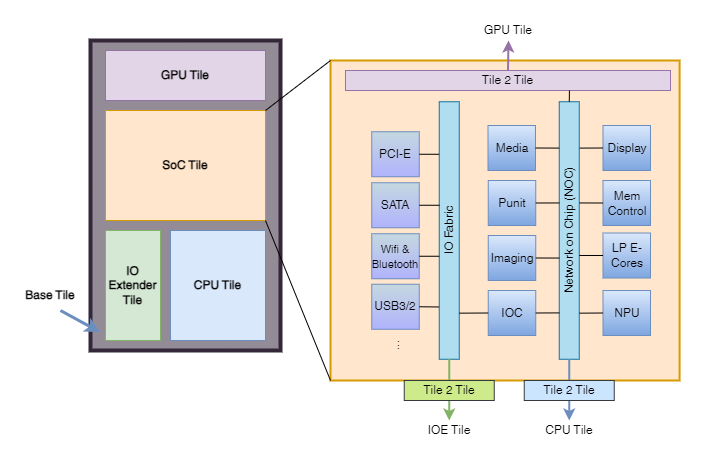

# Processor Chipset Architecture

  
  
<em>Intel Meteror Lake processor architecture. Modern day IC vendors tends to integrate various computation components on one single chipset to facilitate performance. When performing bioimage analysis we often utilise the processor's different computational units. Certain processor architectures facilitate more one specific tasks, e.g. image decode/encode tasks can take advantage of Intel Integrated Performance Primitives (IPP) library with hardware level accelerations.</em>

Modern days computer CPUs are more lean to a System-on-a-Chip (SoC) that integrates all major components of a computing device including CPU, GPU, NPU and RAM. The physically compactness brings shorter communication route among each computing units, hence facilitate computing performance.

However the SoCs may still classified by the CPUs instruction sets, mainly x86 and ARM. Python libraries natively built on one of the architecture may not be directly runnable on the other, unless with OS layer translation or code compilation from source. i.e. Legacy x86 Python libraries may not be runnable on ARM computers. For power performance reason we see chipset manufacturers are releasing new SoCs in ARM architecture, yet most of the existing bioimage analysis software are pre-compiled in x86. With the effort of Apple Rosetta 2, the issue is more relieved yet not 100% compatible. So bare in mind in choosing the adequate CPU for your analysis work.

When necessary, consult the code developer for the support to the CPU platforms. Following is a summary for the CPUs architectures:

| Feature                          | Apple Silicon      | Intel               | AMD               | Snapdragon Xlite   | NVIDIA            |
|----------------------------------|--------------------|---------------------|-------------------|--------------------|--------------------|
| **Architecture**                 | ARM-based          | x86/x86-64          | x86/x86-64        | ARM-based          | ARM-based (Grace CPU) |
| **Notable Series**               | M1, M2             | Core, Xeon          | Ryzen, EPYC       | Snapdragon 8cx     | Grace CPU          |
| **Manufacturing Process**        | 5nm (TSMC)         | 10nm, 7nm, 14nm     | 7nm, 6nm, 5nm     | 7nm (TSMC)         | 5nm (TSMC)         |
| **Performance Cores**            | High-performance   | High-performance    | High-performance  | High-performance   | High-performance   |
| **Efficiency Cores**             | High-efficiency    | Not typical         | Not typical       | High-efficiency    | Not typical        |
| **Integrated Graphics**          | Yes (Apple GPU)    | Yes (Intel Iris, UHD) | Yes (Radeon Graphics) | Yes (Adreno GPU)   | Yes (NVIDIA GPU)   |
| **Thermal Design Power (TDP)**   | Low to moderate    | Moderate to high    | Moderate to high  | Low                | Moderate to high   |
| **Primary Use Cases**            | Laptops, Desktops  | Laptops, Desktops, Servers | Laptops, Desktops, Servers | Laptops, Mobile Devices | HPC, AI, Data Centers |
| **Special Features**             | Unified Memory     | Hyper-Threading, vPro | Simultaneous Multithreading (SMT) | AI Engine, 5G      | AI Acceleration, NVLink |
| **Compatibility**                | macOS              | Windows, Linux, macOS | Windows, Linux   | Windows, Android   | Linux              |