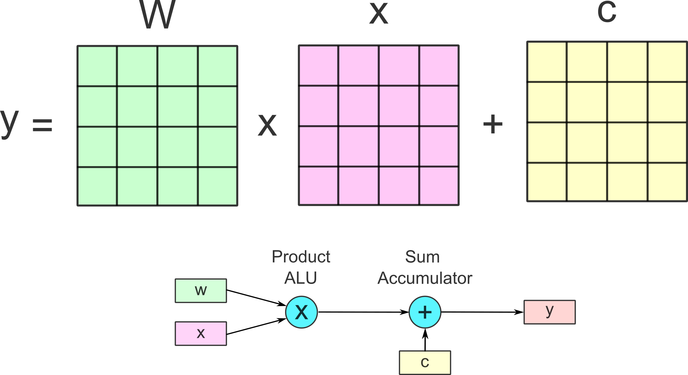

# GPU Support
## AI Training
Though all SoC manufacturers embeds GPU in the chipset, the AI based analysis is largely relying on NVidia CUDA as the base software stack. Common neural network libraries in Python (pyTorch and Tensorflow) are the foundation stone of popular models like UNet, Cellpose and Stardist. Yet we are seeing a recent support to pyTorch AMD ROCm and Intel OneAPI AI acceleration, the community support is fairly limited when comparing to CUDA. Considering the training scalability and infrastructure support across major GPU farms/research clusters, NVidia is still the sole runner when consider new model training.

## AI Inference
Machine learning algorithms consists of two parts: model training and inference. The computation resources for a fixed AI model to be implemented in new data are much smaller than training from scratch. On smaller AI tasks non-CUDA chipsets bring larger options for bioimage analysis. The inference of neural network based AI can be physically accelerated with specifically designed circuits. Such designs are often referred as neural processing units (NPU). NVidia, specifically added Tensor Core in bundle with optimised packages like cuDNN and Transformer Engine, to their later GPU products. We will cover this topic on the later of the article.

  
  
<em>General Matrix Multiplication (GEMM) as the fundamental building block of neural network (NN) operations. The math basis of NNs and image manipulation are similar embarrassingly parallel tasks involving matrices, leading GPU widely used in many machine learning tasks.</em>

## GPGPU Acceleration
Apart from AI applications, bioimage analysis tasks like single plane illumination fluorescent correlation spectroscopy (SPIM-FCS) performs [pixelwise fitting of the autocorrelation function](https://github.com/bpi-oxford/Gpufit/blob/master/Gpufit/models/spim_acfN.cuh). Such image analysis can utilise the parallelisation power of GPU to accelerate the research.

One high level analysis package [py-clesperanto](https://github.com/clEsperanto/pyclesperanto_prototype) attempts GPU acceleration based on OpenCL. Such computing process allows bioimage analysis not bound to graphic processing, but to more generic calculations. From this the GPU is often referred as general purpose GPU (GPGPU). Vendors like AMD and Intel are alternatives to NVidia in this sense.

|                 | **NVIDIA**                                                                                                                                                 | **AMD**                                                                                                                               | **Intel**                                                                                                                            | **Apple**                                                                                                               |
|---------------------------|-------------------------------------------------------------------------------------------------------------------------------------------------------------|---------------------------------------------------------------------------------------------------------------------------------------|---------------------------------------------------------------------------------------------------------------------------------------|------------------------------------------------------------------------------------------------------------------------|
| **OpenCL Support**        | Strong support but secondary to CUDA. Performance is robust.                                                                                               | Major proponent with excellent support and performance.                                                                               | Improved support, especially with newer architectures. Performance historically lagged but is improving.                             | Limited support, focus shifting to Metal.                                                                 |
| **OpenGL Support**        | Excellent performance and highly optimized drivers.                                                                                                        | Strong support, competitive performance, though historically lagged in specific cases.                                               | Solid support, especially for integrated graphics. Significant improvements with newer discrete GPUs.                                | Historically good, but deprecated in favor of Metal.                                                    |
| **Vendor-Specific Toolkit** | **CUDA**: Most mature and widely-used. Extensive libraries and tools. Highly optimized hardware.                                                           | **ROCm**: Comprehensive platform, open-source, flexible. Primarily supports newer GPUs.                                               | **oneAPI**: Unified model supporting multiple architectures. Provides DPC++, integrates OpenCL. Relatively new, still gaining traction. | **Metal**: Modern API designed specifically for Apple hardware. Provides low-level access to GPU features.               |
| **Performance**           | Typically leads in raw performance, especially for CUDA-based applications. Highly optimized.                                                               | Excels in OpenCL applications. High memory bandwidth and compute capabilities.                                                       | Emerging player with promising solutions. Strong integration with CPUs.                                                               | Excellent performance on Apple hardware, particularly optimized for Apple Silicon (M1, M2, etc.).       |