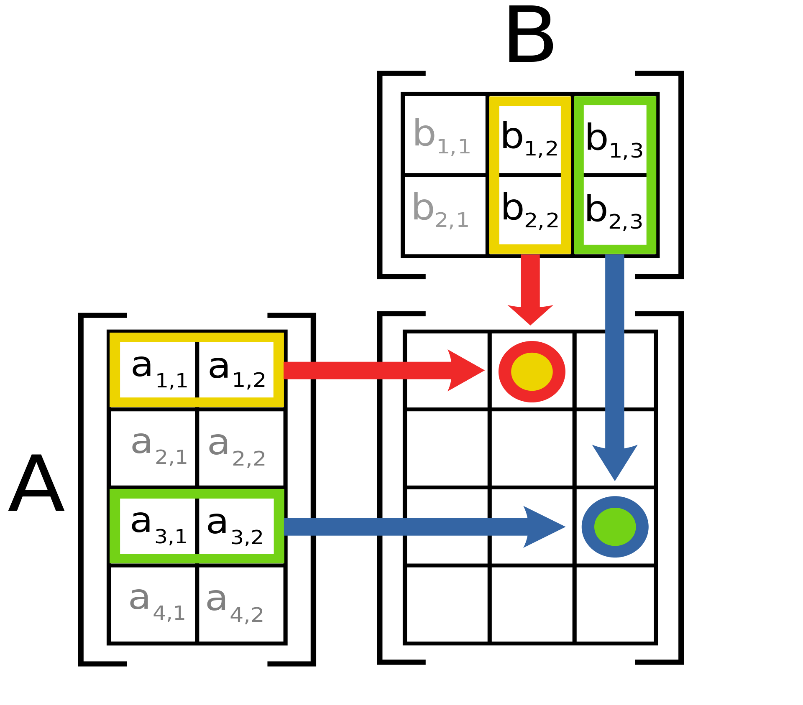

# Neural Processing Unit (NPU)

  
  
<em>Schematic depiction of the outter matrix product AB of two matrices A and B. NPUs implement GEMMs by partitioning the output matrix into tiles, which are then parallel loaded from memory buffer, multiplied and accumulated into output. </em>

A Neural Processing Unit (NPU) is a specialized hardware accelerator designed to efficiently handle the computational demands of AI and machine learning tasks, particularly neural network inference and training. NPUs are optimized for the types of operations commonly used in deep learning, such as matrix multiplications, convolutions, and activation functions. In mid-2024 the NPUs are embedded in various SoCs, allowing a wider choice in AI applications.

| Feature                          | Google TPU (USB/M.2)      | Apple Silicon      | AMD                      | Intel (after Meteor Lake)       | NVIDIA (Grace Hopper)     | NVIDIA (Jetson)           | Snapdragon Xlite          |
|----------------------------------|---------------------------|--------------------|--------------------------|---------------------------|---------------------------|---------------------------|---------------------------|
| **Product Name**                 | Edge TPU                  | Apple Neural Engine| 3rd Gen Ryzen AI| VPU, GNA, AI Engine       | TensorRT, DLA, Grace Hopper| Jetson Xavier, Nano, TX2  | Qualcomm AI Engine        |
| **Primary Use Case**             | Edge AI, Low Power Devices| Mobile, Desktop    | GPUs with AI Capabilities| Mobile, Desktop, Edge AI  | Data Center, HPC, Embedded | Embedded AI     | Mobile, Edge Computing    |
| **Performance**                  | Moderate                  | High               | Moderate to High         | Moderate to High          | Very High                 | Moderate to High          | Moderate                  |
| **Efficiency**                   | High                      | High               | Moderate                 | High                      | Moderate to High          | High                      | High                      |
| **Special Features**             | Google Cloud Compatible, Tensor Operations| Unified Memory, Tight OS Integration | APUs, ROCm | Low Power, Vision Processing, Integrated AI | CUDA Integration, Tensor Cores | Low Power, Integrated AI | Integrated 5G, AI on Device |
| **Flexibility**                  | Specialized for TensorFlow| General Purpose    | AI with General Compute  | Specialized for AI and Vision| Highly Specialized        | General Purpose           | General Purpose           |
| **Compatibility**                | TensorFlow Lite           | macOS              | Windows, Linux           | Windows, Linux            | Windows, Linux            | Linux                     | Android, Windows          |
| **Scalability**                  | High                      | Moderate           | Moderate                 | Moderate                  | High                      | Moderate                  | Moderate                  |
| **Integration**                  | Edge Devices              | Mobile, Desktop    | GPUs                     | Mobile, Desktop, Edge Devices | HPC, Cloud, Embedded      | Embedded Systems| Mobile SoCs               |
| **Availability**                 | USB, M.2 Modules          | Built-in (A-series, M-series)| Radeon Instinct GPUs | Integrated in Meteor Lake CPUs | Available in GPUs, Servers | Available in Embedded Modules | Snapdragon SoCs           |

## External Reading:
- [Get started with tensorflow-metal (AI on Apple Neural Engine)](https://developer.apple.com/metal/tensorflow-plugin/)
- [PluggableDevice: Device Plugin for Tensorflow](https://blog.tensorflow.org/2021/06/pluggabledevice-device-plugins-for-TensorFlow.html)